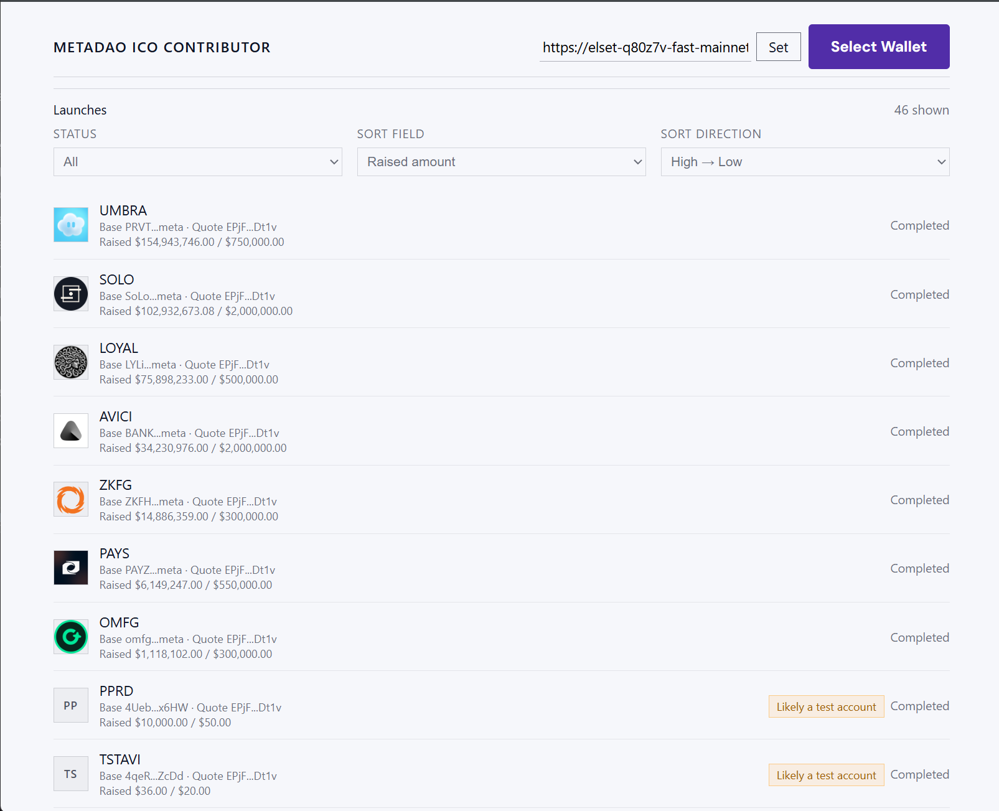

# MetaDAO ICO Contributor

Minimal MetaDAO launchpad frontend you can run with two commands.

## Quick start

```bash
pnpm install
pnpm dev
```

When `pnpm dev` prints the local URL, open it in the browser. If needed adjust the RPC endpoint directly in the UI.

## Requirements

- Node 18+
- pnpm 8+ (install via [`corepack enable`](https://pnpm.io/installation) if you don’t have it yet)

Everything else is installed automatically by `pnpm install`.

