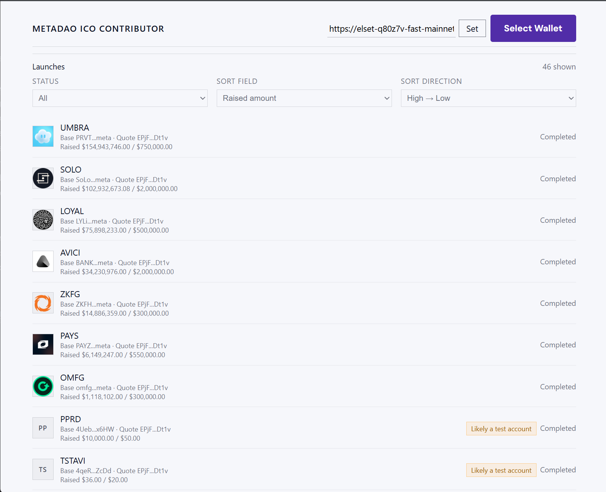

# MetaDAO ICO Contributor

Minimal MetaDAO launchpad frontend you can run with two commands. Built to keep
working when metadao.fi is unreachable (e.g. DDoSed during a raise), and to be
small enough to audit before you trust it with a transaction.

## Quick start

```bash
pnpm install --frozen-lockfile
pnpm dev
```

When `pnpm dev` prints the local URL, open it in the browser. The RPC endpoint
can be changed directly in the top bar (it is saved in your browser). A default
shared Helius endpoint is preconfigured; it is rate-limited, so set your own
RPC if it struggles.

## Requirements

- Node 18+
- pnpm 8+ (install via [`corepack enable`](https://pnpm.io/installation) if you don't have it yet)

Everything else is installed automatically by `pnpm install`.

## Architecture (audit map)

Ten source files. All dependency versions are pinned exactly, and
`--frozen-lockfile` guarantees you install byte-for-byte what was reviewed.

| File | Responsibility |
| --- | --- |
| `src/index.tsx` | Entry point: wallet adapters (Phantom/Solflare), RPC endpoint state (persisted to localStorage), router. |
| `src/App.tsx` | Top bar, RPC URL validation, error boundary + lazy loading for the panel. |
| `src/LaunchList.tsx` | Fetches launch accounts from the v0.5/v0.6/v0.7 programs, filters/sorts/searches client-side. Read-only. |
| `src/ContributePanel.tsx` | The contribute/claim UI. Builds transactions only on explicit button clicks. |
| `src/utils/launchpad.ts` | **The trust surface for on-chain data.** Every call into the MetaDAO SDK (fetching launches, building fund/claim instructions, PDA derivations) goes through the typed wrappers here — components contain no SDK casts. |
| `src/utils/sendSmartTransaction.ts` | **The only code that touches your wallet.** Simulates, sets compute budget/priority fee, signs, sends, confirms, and checks the on-chain result. Nothing signs or sends outside this file. |
| `src/utils/number.ts` | All money math, in exact bigint arithmetic — no floats anywhere in amount handling. |
| `src/utils/tokenMetadata.ts` | Token names/logos via Helius DAS (display only; logo URLs are scheme-filtered and fetched with no referrer). |
| `src/types/launch.ts` | The `LaunchRow` shape shared by list and panel. |
| `src/polyfills.ts` | Node globals for browser (Buffer, process). |

Things worth verifying yourself before contributing real funds:

- The panel shows the launch, base-mint, and quote-mint addresses with copy
  buttons and Solscan links — check them against MetaDAO's official
  announcement. Token names and logos come from RPC metadata and can be forged
  by anyone; addresses cannot.
- A transaction is only ever signed after you click **Contribute** or **Claim**,
  and it is simulated first; a simulation failure aborts before your wallet is
  asked to sign.


